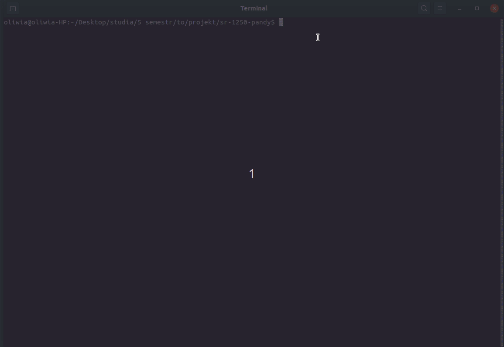
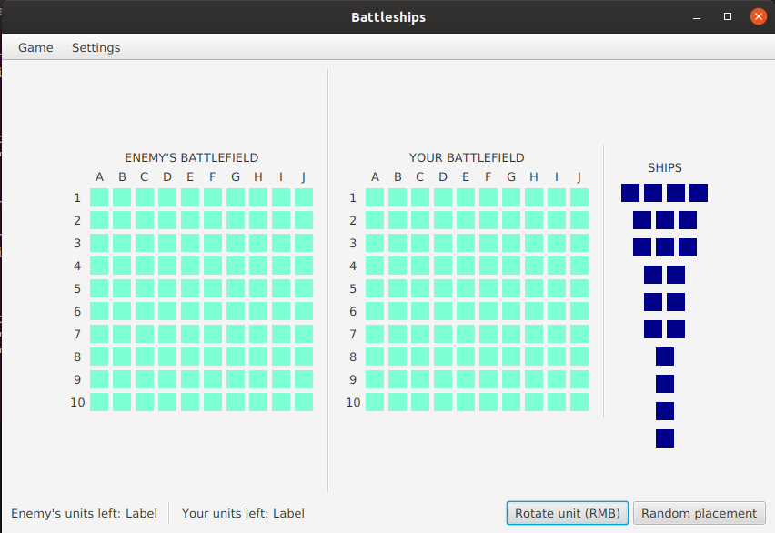
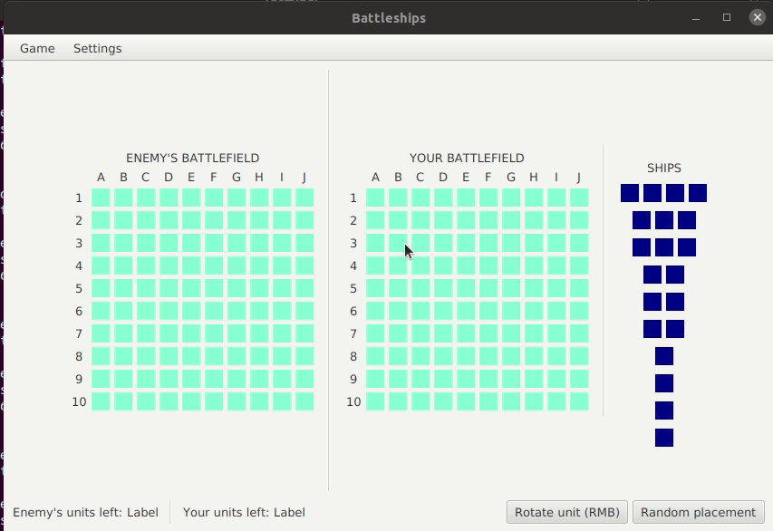
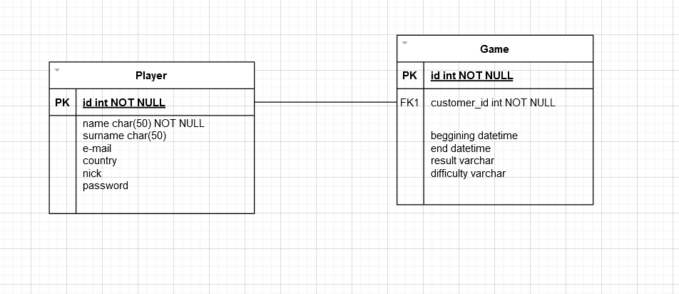
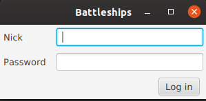
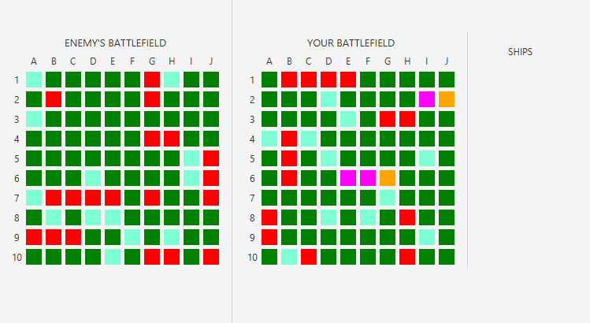

# Dokumentacja
# Statki
Projekt jest realizowany w ramach laboratorium z technologii obiektowych na semestrze V kierunku Informatyka.


# *Autorzy projektu:*
- *Michał Kurleto*
- *Oliwia Masiarek*
- *Tomasz Rosiek*

# Odpowiedzialności w projekcie:
- *Michał Kurleto*:
  - tworzenie modelu
  - implementacja modelu

- *Oliwia Masiarek*:
  - tworzenie modelu
  - opracowanie mechaniki dodawania statków
  - dokumentacja

- *Tomasz Rosiek*:
  - tworzenie modelu
  - opracowanie mechaniki dodawania statków oraz implementacja


# Cel projektu
Celem projektu jest stworzenie gry *Statki*.
Ogólne zasady dostępne są na wikipedii: [Zasady](https://pl.wikipedia.org/wiki/Okr%C4%99ty)

# Uruchomienie aplikacji
W terminalu w katalogu głównym należy wykonać następujące komendy:

```
chmod u+x gradlew
```
```
./gradlew build
```

```
./gradlew run
```




# Architektura aplikacji
Aplikacja budowana jest w oparciu o wzorzec Model, View, Controller.

# Model
## Diagram klas modelu


### Podstawowe klasy

#### AbstractPlayer
Klasa abstrakcyjna, która reprezentuje gracza. Każdy gracz posiada dwie plansze - własną oraz przeciwnika. Na własnej planszy będzie ustawiał własne statki, a na przeciwnika rozgrywał. Każdy gracz ma również dostępne statki, które musi rozmieścić na planszy. Gracz może wykonywać ruchy.

### Board
Klasa planszy, która składa się z komórek (klasa Cell). Na planszy możemy atakować oraz ustawiać statki.

### Cell
Klasa komórki - reprezentuje pojedyncze pole planszy. Każda komórka ma obserwatorów oraz reprezentuje konkretny stan.

### Game
Klasa reprezentująca rozgrywkę. Skupia dwóch graczy, którzy rozgrywają partię gry.

### Position
Klasa, która reprezentuje połóżenie.

### Ship
Klasa reprezentująca statek. Każdy statek posiada informacje o swojej długości, położeniu na planszy oraz swoim stanie.

### PlayerInfo
Klasa, która posiada podstawowe informacje o graczu oraz umożliwia uzyskanie statystyk danego gracza.

### PlayerRanking
Klasa skupiająca wszystkich graczy.

# GUI
Po uruchomieniu aplikacji mamy dwie plansze oraz statki do rozstawienia.
Plansza lewa - Enemy Board służy do rozgrywki, natomiast plansza prawa - Player Board służy do rozstawienia statków oraz w trakcie rozgrywki widzimy stan naszej planszy po ruchach przeciwnika.



## Rozstawianie statków
Rozstawienie statków odbywa się poprzez przeciągnięcie myszką po odpowiedniej ilości pól na planszy. Dostępne statki widzimy po prawej stronie od planszy playera. Statki muszą być układane w linii prostej. Jeżeli chcemy zakończyć ustawienie statku to kursor myszki musi być na danym polu.




## Użyte wzorce

### Observer
Wzorzec użyty w klasie *Ship*. Każda komórka *Cell* posiada obserwatorów, którzy są informowani po zmianie statusu komórki.

```java
public interface CellObserver {
    /**
     * calls the observer after status of the cell was changed
     * @param newStatus the updated cell status
     */
    void update(CellStatus newStatus);
}
```

```java
public class Cell {
    /***/

    private final Collection<CellObserver> observers = new ArrayList<>();

    /***/

    /**
     * adds a new observer to the cell
     * @param observer new observer to be added
     */
    public void addObserver(CellObserver observer){
        observers.add(observer);
    }

    /**
     * notifies all observers of the cell
     */
    private void notifyObservers(){
        for (CellObserver observer: observers) {
            observer.update(status);
        }
    }
}
```

```java
public class Ship implements CellObserver{
    private Collection<Cell> cells;

    /***/

    /**
     * for each cell sets it's status as SHIP and adds the ship as an observer
     * @param cells collection of cells that represent the ship
     */
    public void setCells(Collection<Cell> cells) {

         /***/

        this.cells = cells;
        for (Cell cell : cells) {
            cell.setStatus(CellStatus.SHIP);
            cell.addObserver(this);
        }
    }

    /***/


    /**
     * if the cell was hit, check if the ship has sunk
     * @param newStatus the updated cell status
     */
    @Override
    public void update(CellStatus newStatus) {
        if(newStatus == CellStatus.HIT)
            checkIfSunk();
    }
}
```

---

# M2
## Wymagania i odpowiedzialość
[✔] działająca warstwa persystencji (**Oliwia Masiarek**)<br>
[✔] autentykacja i autoryzacja (**Oliwia Masiarek, Tomasz Rosiek**)<br>
[✔] przebieg rozgrywki (**Tomasz Rosiek**)<br>
[✔] obsługa poziomu trudności (**Michał Kurleto**)<br>
[✔] dokumentacja (**Michał Kurleto**)<br>

---
## Wykorzystane wzorce projektowe
- Factory (klasa **BotFactory**)
- DAO (pakiet `java.model.dao`)
- MVC (pakiety `java.model`, `resources.view`, `java.controller`)
- Observer (klasa **CellObserver**)

---
## Warstwa persystencji
Warstwa persystencji wykorzystuje Hibernate, wzorzec DAO oraz bazę danych SQLite.   

Diagram bazy:


`java.model.data`   
- **PlayerInfo** - odpowiada tabeli Player z bazy danych
- **GameInfo** - odpowiada tabeli Game z bazy danych

`java.model.dao`
- **PlayerInfoDAO** - odpowiada zapis/odczyt informacji o graczu z bazy danych
- **PlayerStatisticDAO** - odpowiada za pobieranie statystyk graczy z bazy
- **GameInfoDAO** - odpowiada za pobieranie wyników gier z bazy

Za połączenie z bazą danych odpowiada klasa **SessionService**.

---
## Autentykacja i autoryzacja
W pełni zaimplementowane są widoki logowania i rejestracji oraz odpowiadające im kontrolery.
Jednak widoki te nie są jeszcze podłączone do głównej aplikacji.

### Logowanie
Kontroler: **LoginDialogController**   
Widok: **LoginDialog.fxml**




### Rejestracja
Kontroler: **SignUpDialogController**   
Widok: **SignUpDialog.fxml**   


---
## Przebieg rozgrywki
Rozgrywka jest w pełni zaimplementowana. Po uruchomieniu programu według instrukcji i ustawieniu wszystkich statków gra rozpoczyna się. Na razie gra uruchamia się defaultowo na jednym poziomie trudności (pomimo, że inne są już zaimplementowane), ponieważ nie ma jeszcze widoku tworzenia nowej gry.   
Żeby wykonać ruch należy kliknąć na wybrane pole na planszy przeciwnika (plansza po lewej).


### Legenda kolorów
-  `Woda`
-  `Statek`
-  `Trafiony`
-  `Trafiony zatopiony`
-  `Pudło`

---
## Obsługa poziomu trudności
Gra obsługuje dwa poziomy trudności **Easy** i **Hard**. Implementacja znajduje poziomów trudności rozgrywki znajduje się odpowienio w klasach **EasyBot** i **HardBot** w pakiecie `java.model.game.bot`<br>
Zastosowano również wzorzec factory (klasa **BotFactory**) do tworzenia odpowiedniego bota na podstawie wybranego poziomu trudności.

### EasyBot:
Wykonuje wszystkie ruchy losowo.

### HardBot:
Wykonuje ruchy losowo do momentu aż trafi statek przeciwnika, wtedy następne ruchy są wykonywane w okolicy dopóki statek nie zostanie zatopiony.


---

# M3
## Wymagania i odpowiedzialość
[✔] Poprawa wizualna (**Oliwia Masiarek, Tomasz Rosiek**)<br>
[✔] Ranking (**Oliwia Masiarek, Tomasz Rosiek**)<br>
[✔] Notyfikacje mailami (**Michał Kurleto**)<br>
[✔] Dokumentacja (**Michał Kurleto**)<br>
[✔] Tooltipy - podpowiadanie (**Tomasz Rosiek**)<br>
[❌] Autoryzacja <br>

---
## Poprawa wizualna
Wszytkie widoki, które nie były gotowe (podpięte do głównej aplikacji) na czas oddania m2 są teraz w pełni funkcjonalne. Po zalogowaniu się wyświetla się widok lobby z aktualnym rankingiem oraz możliwością rozpoczęcia nowej gry.<br>
Przed rozpoczęciem nowej gry należy wybrać poziom trudności.


Do panelu rozgrywnki dodano przycisk pozwalający na losowe ustawienie statkó na planszy oraz legende kolorów.


Po zakończeniu gry pojawia się komunikat o jej wyniku.


---
## Ranking
Ranking wyświetlany jest w lobby. O pozycji w rankingu decyduje liczba wygranych oraz przegranych.<br> 
Gracze są powiadamiani mailowo jeśli spadną w rankingu.


---
## Notyfikacje mailami
Notyfikacje mailowe są zaimplementowane w klasie **EmailService**.  
Gracz otrzymuje powiadomienie mailowe jeśli: 
- poprawnie zarejestruje konto
- spadnie w rankingu.<br>

Przykładowe maile wysłane z aplikacji:


---
## Tooltipy
Do głównego panelu gry została dodana legenda kolorów.<br><br>

<br><br>Dodane zostały alerty potwierdzające rejestrację oraz koniec gry.<br><br>

